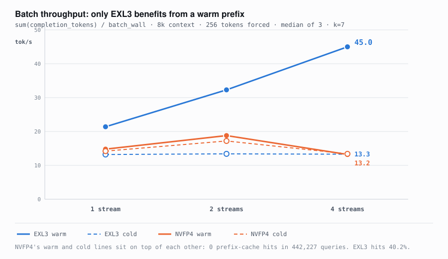
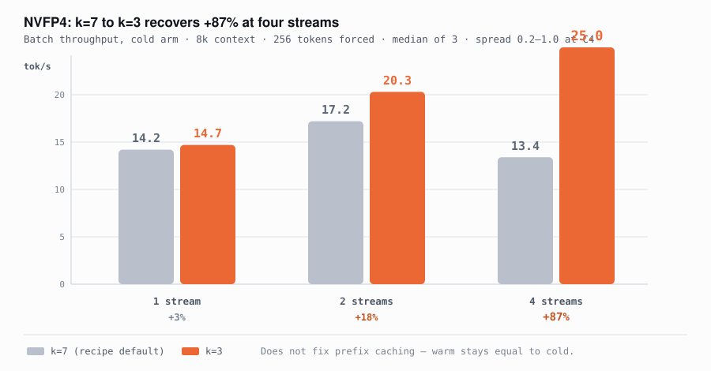
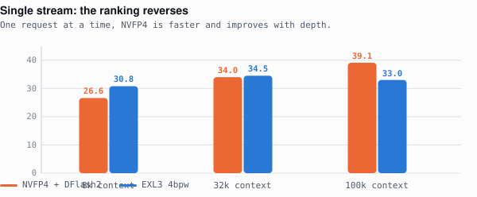

# GLM-5.3-Flash on 2× GB10: the concurrency inversion

Same model, two quantizations, one 2-node DGX Spark–class cluster (GB10, 121 GiB
unified memory each, tensor-parallel 2 over dual-rail RoCE).

**Alone, NVFP4 is the faster engine. Add a second user and it loses three quarters
of its throughput, while EXL3 does not move.** Benchmark one request at a time and
you will pick the wrong engine.

📄 **Write-up:** [One model, two engines, opposite answers](https://claude.ai/code/artifact/505b2309-aa5c-46ed-8092-e60404a8c56b)



Read the left-hand points and NVFP4 looks fine — level with EXL3 or ahead. Read the
right-hand points and it has collapsed. EXL3's line is flat in all three panels.

**Context depth is a red herring.** NVFP4 collapses at 8k as hard as at 100k. The
variable is concurrency alone.

---

## Aggregate throughput



Same two machines. EXL3 turns six users into **5.6×** the throughput of one;
NVFP4 manages **2×**.

## Single stream — the opposite result



One request at a time, NVFP4 climbs from 26.6 to 39.1 tok/s as the prompt grows to
100k, and prefills faster too (**1009 vs 789 tok/s** at 100k — 27 seconds less
waiting for the first token). Every one of those numbers is real, and every one is
irrelevant once a second session opens.

---

## Numbers

### Per-stream decode (tok/s)

| depth | streams | NVFP4 | EXL3 |
|---|---|---|---|
| 8k | 1 | 30.1 | 28.8 |
| 8k | 2 | 14.3 | **26.5** |
| 8k | 4 | 7.1 | **26.7** |
| 8k | 6 | 8.3 | **26.9** |
| 32k | 1 | 28.7 | 33.9 |
| 32k | 2 | 15.0 | **27.6** |
| 32k | 3 | 9.3 | **28.0** |
| 100k | 1 | **40.3** | 29.2 |
| 100k | 2 | 27.3 | 27.8 |
| 100k | 3 | 10.2 | **30.8** |

### Aggregate (tok/s, all streams summed)

| depth | streams | NVFP4 | EXL3 |
|---|---|---|---|
| 8k | 1 / 2 / 4 / 6 | 30.1 / 28.5 / 38.8 / 59.4 | 28.8 / 53.0 / 109.6 / **161.7** |
| 32k | 1 / 2 / 3 | 28.7 / 30.0 / 30.8 | 33.9 / 55.2 / **84.7** |
| 100k | 1 / 2 / 3 | 40.3 / 54.7 / 59.0 | 29.2 / 55.6 / **90.4** |

### Single stream, by depth

| depth | NVFP4 prefill / decode | EXL3 prefill / decode |
|---|---|---|
| 8k | 524 / 26.6 | 550 / **30.8** |
| 32k | **1028** / 34.0 | 732 / 34.5 |
| 100k | **1009** / **39.1** | 789 / 33.0 |

### Coding workloads, single stream, 1024 tokens

| workload | NVFP4 tok/s | EXL3 tok/s | NVFP4 wall | EXL3 wall |
|---|---|---|---|---|
| iOS · SwiftUI login | **38.1** | 35.2 | 27.7s | 29.3s |
| Android · Compose list | **37.7** | 34.2 | 27.4s | 30.3s |
| Website · landing page | 37.2 | **42.1** | 27.8s | 24.7s |
| Python · async worker pool | **33.5** | 28.2 | 30.8s | 36.7s |

The generated code for all eight runs is in [`outputs/`](outputs/). Both engines
produced near-identical architecture — same module tree, same opening sentence —
so quantization is changing the *rate*, not the answer.

---

## CORRECTION 2 (2026-08-30): k=3 recovers +87% at C4 — the collapse had two causes

A reader pointed out that our negative k=5 result says nothing about k=3, and that
they had measured +28% at C6 on a TP4 stack with `FULL_DECODE_ONLY` CUDA graphs.
**They were right.** Measured here at 8k with bench v3:

| 8k | k=7 | **k=3** | |
|---|---|---|---|
| C4 batch, cold | 13.4 | **25.0** | **+87%** |
| C4 batch, warm | 13.2 | **24.7** | **+87%** |
| C4 p50 decode rate | 5.6 | **11.5** | +105% |
| C4 p50 latency | 67.0s | **40.1s** | −40% |
| C2 batch, cold | 17.2 | **20.3** | +18% |
| C1 batch, cold | 14.2 | 14.7 | +3% (inside spread) |

C4 spread was 0.2–1.0 tok/s, so +87% is far outside noise, and nothing regressed.
They saw it on TP4 *with* CUDA graphs; we reproduce it on TP2 with `--enforce-eager`
and no CUDA graphs, so the effect is robust across configurations.

**This repo previously claimed "acceptance is a per-position quality problem, so
removing positions cannot help."** That was generalised from one negative k=5 test
and is deleted.


### So the collapse had two independent causes

| cause | fixable | effect |
|---|---|---|
| k=7 speculative overhead under batch | **yes — k=3** | +87% at C4 |
| no prefix caching (`KpoolTailManager`) | no workaround found | warm ≡ cold |

With k=3 the comparison splits by arm:

- **Cold C4: NVFP4 25.0 vs EXL3 13.3** — NVFP4 nearly 2× ahead
- **Warm C4: NVFP4 24.7 vs EXL3 45.0** — EXL3 1.8× ahead, entirely on cache reuse

Agent sessions are warm, so EXL3 stays the right default for them — but **NVFP4 at
k=3 is now competitive**, and better for cold or one-shot concurrent work.

---

## CORRECTION 1 (2026-08-30): the cause is prefix caching, and the original metric was wrong

Two corrections, both material. Everything below this section is the original
write-up and is superseded where it conflicts.

### 1. The aggregate metric was wrong

v1 computed `aggregate = sum(per-stream decode rate)`. Those windows do not overlap
when streams are staggered or queued, so it is **not** cluster throughput. Correct
is `sum(completion_tokens) / batch_wall`. v1 also stored no per-request token
counts, so nothing could be recomputed from the published artifact. Both flaws were
pointed out by a reader and both are real.

**The "EXL3 turns six users into 5.6× the throughput" claim is withdrawn.** The two
engines' `max_num_seqs` also differed (EXL3 4, NVFP4 6), thinking was on for EXL3
and off for NVFP4 in the entire concurrency phase, and every prompt used a unique
salt — a cold-prefill worst case presented as a typical agent workload.

### 2. NVFP4's prefix cache never hits — that is the real mechanism

```
vllm:prefix_cache_queries_total   442,227
vllm:prefix_cache_hits_total            0
```

Zero hits, ever. The engine enables prefix caching, then:

```
WARNING [kv_cache_coordinator.py:611] Disabling fine-grained prefix-cache hits
because these KV cache managers require block-aligned lookups: KpoolTailManager
```

`KpoolTailManager` is part of the SM121 sparse-attention indexer patch the NVFP4
recipe requires on GB10. **There is no alignment workaround** — a prompt
binary-searched to exactly 4608 tokens (2 × `block-size 2304`), sent twice, still
gets zero hits:

| prompt | hits | queries |
|---|---|---|
| 4608 tok, exactly 2×2304 | **+0** | +9,216 |
| 4611 tok, unaligned | +0 | +9,222 |

### Corrected numbers (v3: `ignore_eos`, 3 runs, thinking off both, matched levels)


Batch throughput, tok/s, 8k context:

| streams | NVFP4 cold | NVFP4 warm | EXL3 cold | EXL3 warm |
|---|---|---|---|---|
| 1 | 14.2 | 14.8 | 13.2 | **21.4** |
| 2 | **17.2** | 18.8 | 13.4 | **32.3** |
| 4 | 13.4 | 13.2 | 13.3 | **45.0** |

**Cold C4 is a tie** (13.4 vs 13.3) — no engine advantage. **NVFP4 gains nothing
from a warm prefix** (13.4 → 13.2) because it cannot cache. EXL3, at a 40.2% hit
rate, goes 13.3 → 45.0. TTFT at warm C4: **17.7 s vs 2.6 s**.

For agent sessions — which reuse context every turn — this is the whole story. A
100k conversation re-prefills 100k tokens per turn on NVFP4.

Reported upstream as
[tonyd2wild#13](https://github.com/tonyd2wild/GLM-5.3-Flash-NVFP4-DFlash2-2x-DGX-Spark/issues/13).

### What this means about the explanations below

The "acceptance collapse" section that follows is **a correlate, not the cause**.
Acceptance does fall under concurrency and that is measured correctly, but the
dominant effect is prefill re-computation. Four explanations have now been tested:
KV preemption (falsified by a larger pool), acceptance-as-cause (falsified by
removing the drafter entirely), speculation overhead (falsified — removing DFlash2
halves single-stream and does not fix concurrency), and finally prefix caching,
which is the first with a direct causal measurement.

The routing decision — EXL3 for agent sessions — is unchanged and better supported
than before.

---

## Why NVFP4 falls over

Not memory. Three deep sessions need ~300k tokens of KV against a 410k pool, so the
obvious theory is eviction and prefill recompute. We tested it by raising the pool
25% (4 → 5 GiB pin, 410,427 → 513,696 tokens).

**It changed nothing** — C3 went 6.1 → 5.4 tok/s, slightly worse. The engine log
during the collapse:

```
preemption events            0
peak KV usage                83.9%     (3 running, 0 waiting)
spec acceptance @ C3         18.2% – 38.2%
spec acceptance @ C1         70% – 89%
mean accept length @ C3      2.27 – 3.67
mean accept length @ C1      5.94 – 7.21
```

Nothing is ever evicted and nothing ever queues. Acceptance is clearly part of it:
DFlash2 proposes tokens the main model verifies, and alone it lands 6–7 per step,
but verifying several contexts in one batch drops that under a third.

Cutting the drafter from k=7 to k=5, as upstream proposes, made no difference to
short work and was **worse** at depth (C3 6.1 → 5.0).

### …but acceptance is not the whole cause

A reader suggested removing the drafter entirely. Good reasoning — speculation
verifies k+1 positions per stream, so four streams ask an already-saturated batch
for roughly 8× the work. Tested at 8k:

| | with DFlash2 | without |
|---|---|---|
| C1 per-stream | 30.1 | **14.1** |
| C4 per-stream | 7.1 | **8.0** |
| C4 aggregate | 38.8 | **34.6** |
| KV pool | 410,427 | **615,641** |

**Removing it halves single-stream and does not fix concurrency.** Keep the drafter.

But compare the C1→C4 drop in each column: **−76% with DFlash2, still −43% with no
speculative decoding at all.** So there is a substantial batching penalty underneath
the acceptance effect that has nothing to do with the drafter. Acceptance decay
amplifies the fall because there is further to fall from; it does not create it.

**The mechanism behind that residual 43% is unknown.** Two explanations have been
tested and withdrawn — KV preemption (falsified by a 25% larger pool) and
acceptance-as-sole-cause (falsified by this test). The freed pool here, 615,641
tokens at 2.35× concurrency, changing nothing is a third independent confirmation
that capacity was never the constraint. If you know what this is, please open an
issue.

---

## EXL3: `DFLASH_DRAFT_TP=2` is worth +37% under concurrency

Upstream changed this default on 2026-08-30
([#48](https://github.com/MiaAI-Lab/GLM-5.3-Flash-EXL3-2x-DGX-Sparks/pull/48)) — it
shards the ~2.3 GiB DFlash2 drafter across both ranks instead of pinning it to rank
0. Their commit reports the numbers "held", i.e. neutral, measured idle and
single-stream.

Under concurrency it is not neutral at all. At 8k:

| 8k, per-stream decode | `draft_tp=1` | `draft_tp=2` | |
|---|---|---|---|
| C1 | 28.8 | **33.4** | +16% |
| C4 | 26.7 | **36.6** | **+37%** |
| C4 aggregate | 109.6 | **143.9** | +31% |

At `draft_tp=2` the serve *gains* per-stream throughput from C1 → C4 (33.4 → 36.6).
No other configuration tested here does that.

**But their single-stream gain does not reproduce on this kit.** Running their own
`tests/bench_decode.py`, same protocol:

| | upstream `tp=2` | ours `tp=1` | ours `tp=2` |
|---|---|---|---|
| structured | 65.1 | 64.3 | **63.2** |
| prose | 27.1 | 26.6 | **25.4** |

They measure +5.5% structured; we measure −1.7% structured and −4.5% prose. Our
`tp=1` baseline did reproduce their earlier published figures closely, so this is
not a harness difference.

**It costs KV pool: 1,754,237 → 1,444,444 tokens** (1.75× → 1.44× at 1M context).
Sharding the drafter allocates draft KV on both ranks and the pool takes the
minimum — the opposite of the memory saving you might expect. 18% of pool for +37%
at C4 is a good trade at this context length, but check your headroom first if you
run near the concurrency ceiling.

Reported upstream as
[issue #56](https://github.com/MiaAI-Lab/GLM-5.3-Flash-EXL3-2x-DGX-Sparks/issues/56).

The wider point is the same one this repo keeps running into: **a change can be
neutral idle and decisive under load.** Upstream's evidence was not wrong, it was
measured on the axis where the effect does not appear.

---

## Reproducing

Both engines must already be serving behind an OpenAI-compatible endpoint. The
scripts assume a router on `127.0.0.1:8600` exposing both model ids — point `EP` at
whatever you have.

```bash
# full matrix: 4 coding workloads, depth sweep, concurrency × depth
python3 benchmarks/bench_suite.py

# EXL3 with thinking disabled (required for a like-for-like comparison)
python3 benchmarks/bench_phase_a_thinking_off.py
```

Results land in `results/results.json`; generated code in `outputs/`.

**Every prompt carries a unique salt.** Without it the prefix cache serves one run
from another's work and TTFT becomes fiction — this is the single easiest way to
publish a wrong prefill number.

Settings for each engine: [`configs/nvfp4.md`](configs/nvfp4.md) ·
[`configs/exl3.md`](configs/exl3.md). **Exact upstream commits to check out:
[`configs/upstream-pins.md`](configs/upstream-pins.md)** — both recipes were moving
fast (one took 20 commits in a single day), so a later `main` may not reproduce
these numbers. Both include the gotchas that cost us the most
time, including two that will silently corrupt your results rather than fail loudly.

---

## Caveats

- **Single run per cell.** NVFP4's 100k C3 measured 5.4, 6.1 and 10.2 tok/s on three
  separate occasions. The *pattern* is stable across every depth and repeat; treat
  any individual figure as approximate.
- **The two engines run on different node pairs.** This compares two deployments,
  not quantization formats in clean isolation.
- **EXL3 needed `enable_thinking: false`.** Its first pass returned 1024 tokens and
  zero visible characters — the entire budget went to reasoning, while NVFP4 ships
  with thinking off. Check this before trusting any cross-recipe comparison.
- **Speculative decoding makes throughput workload-dependent.** A "count from 1 to
  200" prompt accepts ~95% and runs at 64 tok/s; real prose accepts ~33% and runs at
  27. Headline numbers from either recipe are usually the former; production code
  sits in between.

## Credits

- NVFP4 + DFlash2 recipe — [tonyd2wild](https://github.com/tonyd2wild/GLM-5.3-Flash-NVFP4-DFlash2-2x-DGX-Spark)
- EXL3 recipe — [MiaAI-Lab](https://github.com/MiaAI-Lab/GLM-5.3-Flash-EXL3-2x-DGX-Sparks)
- Base model — GLM-5.3-Flash · Drafter — `incoai/GLM-5.3-Flash-DFlash2`

Measured 2026-08-30.
