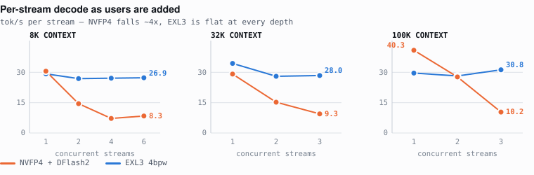
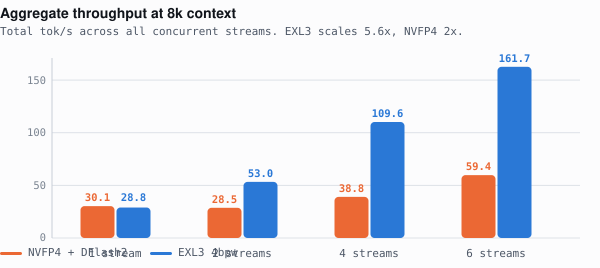

# GLM-5.3-Flash on 2× GB10: the concurrency inversion

Same model, two quantizations, one 2-node DGX Spark–class cluster (GB10, 121 GiB
unified memory each, tensor-parallel 2 over dual-rail RoCE).

**Alone, NVFP4 is the faster engine. Add a second user and it loses three quarters
of its throughput, while EXL3 does not move.** Benchmark one request at a time and
you will pick the wrong engine.



Read the left-hand points and NVFP4 looks fine — level with EXL3 or ahead. Read the
right-hand points and it has collapsed. EXL3's line is flat in all three panels.

**Context depth is a red herring.** NVFP4 collapses at 8k as hard as at 100k. The
variable is concurrency alone.

---

## Aggregate throughput



Same two machines. EXL3 turns six users into **5.6×** the throughput of one;
NVFP4 manages **2×**.

## Single stream — the opposite result


One request at a time, NVFP4 climbs from 26.6 to 39.1 tok/s as the prompt grows to
100k, and prefills faster too (**1009 vs 789 tok/s** at 100k — 27 seconds less
waiting for the first token). Every one of those numbers is real, and every one is
irrelevant once a second session opens.

---

## Numbers

### Per-stream decode (tok/s)

| depth | streams | NVFP4 | EXL3 |
|---|---|---|---|
| 8k | 1 | 30.1 | 28.8 |
| 8k | 2 | 14.3 | **26.5** |
| 8k | 4 | 7.1 | **26.7** |
| 8k | 6 | 8.3 | **26.9** |
| 32k | 1 | 28.7 | 33.9 |
| 32k | 2 | 15.0 | **27.6** |
| 32k | 3 | 9.3 | **28.0** |
| 100k | 1 | **40.3** | 29.2 |
| 100k | 2 | 27.3 | 27.8 |
| 100k | 3 | 10.2 | **30.8** |

### Aggregate (tok/s, all streams summed)

| depth | streams | NVFP4 | EXL3 |
|---|---|---|---|
| 8k | 1 / 2 / 4 / 6 | 30.1 / 28.5 / 38.8 / 59.4 | 28.8 / 53.0 / 109.6 / **161.7** |
| 32k | 1 / 2 / 3 | 28.7 / 30.0 / 30.8 | 33.9 / 55.2 / **84.7** |
| 100k | 1 / 2 / 3 | 40.3 / 54.7 / 59.0 | 29.2 / 55.6 / **90.4** |

### Single stream, by depth

| depth | NVFP4 prefill / decode | EXL3 prefill / decode |
|---|---|---|
| 8k | 524 / 26.6 | 550 / **30.8** |
| 32k | **1028** / 34.0 | 732 / 34.5 |
| 100k | **1009** / **39.1** | 789 / 33.0 |

### Coding workloads, single stream, 1024 tokens

| workload | NVFP4 tok/s | EXL3 tok/s | NVFP4 wall | EXL3 wall |
|---|---|---|---|---|
| iOS · SwiftUI login | **38.1** | 35.2 | 27.7s | 29.3s |
| Android · Compose list | **37.7** | 34.2 | 27.4s | 30.3s |
| Website · landing page | 37.2 | **42.1** | 27.8s | 24.7s |
| Python · async worker pool | **33.5** | 28.2 | 30.8s | 36.7s |

The generated code for all eight runs is in [`outputs/`](outputs/). Both engines
produced near-identical architecture — same module tree, same opening sentence —
so quantization is changing the *rate*, not the answer.

---

## Why NVFP4 falls over

Not memory. Three deep sessions need ~300k tokens of KV against a 410k pool, so the
obvious theory is eviction and prefill recompute. We tested it by raising the pool
25% (4 → 5 GiB pin, 410,427 → 513,696 tokens).

**It changed nothing** — C3 went 6.1 → 5.4 tok/s, slightly worse. The engine log
during the collapse:

```
preemption events            0
peak KV usage                83.9%     (3 running, 0 waiting)
spec acceptance @ C3         18.2% – 38.2%
spec acceptance @ C1         70% – 89%
mean accept length @ C3      2.27 – 3.67
mean accept length @ C1      5.94 – 7.21
```

Nothing is ever evicted and nothing ever queues. What collapses is the
**speculative drafter**. DFlash2 proposes tokens the main model verifies; alone it
lands 6–7 per step. Verifying several contexts in one batch, acceptance falls under
a third — so every step pays the full draft-and-verify cost and keeps a fraction of
the output.

That also kills the other obvious fix: cutting the drafter from k=7 to k=5, as
upstream proposes, made no difference to short work and was **worse** at depth
(C3 6.1 → 5.0). Acceptance is a per-position quality problem; removing positions
cannot help.

---

## Reproducing

Both engines must already be serving behind an OpenAI-compatible endpoint. The
scripts assume a router on `127.0.0.1:8600` exposing both model ids — point `EP` at
whatever you have.

```bash
# full matrix: 4 coding workloads, depth sweep, concurrency × depth
python3 benchmarks/bench_suite.py

# EXL3 with thinking disabled (required for a like-for-like comparison)
python3 benchmarks/bench_phase_a_thinking_off.py
```

Results land in `results/results.json`; generated code in `outputs/`.

**Every prompt carries a unique salt.** Without it the prefix cache serves one run
from another's work and TTFT becomes fiction — this is the single easiest way to
publish a wrong prefill number.

Settings for each engine: [`configs/nvfp4.md`](configs/nvfp4.md) ·
[`configs/exl3.md`](configs/exl3.md). **Exact upstream commits to check out:
[`configs/upstream-pins.md`](configs/upstream-pins.md)** — both recipes were moving
fast (one took 20 commits in a single day), so a later `main` may not reproduce
these numbers. Both include the gotchas that cost us the most
time, including two that will silently corrupt your results rather than fail loudly.

---

## Caveats

- **Single run per cell.** NVFP4's 100k C3 measured 5.4, 6.1 and 10.2 tok/s on three
  separate occasions. The *pattern* is stable across every depth and repeat; treat
  any individual figure as approximate.
- **The two engines run on different node pairs.** This compares two deployments,
  not quantization formats in clean isolation.
- **EXL3 needed `enable_thinking: false`.** Its first pass returned 1024 tokens and
  zero visible characters — the entire budget went to reasoning, while NVFP4 ships
  with thinking off. Check this before trusting any cross-recipe comparison.
- **Speculative decoding makes throughput workload-dependent.** A "count from 1 to
  200" prompt accepts ~95% and runs at 64 tok/s; real prose accepts ~33% and runs at
  27. Headline numbers from either recipe are usually the former; production code
  sits in between.

## Credits

- NVFP4 + DFlash2 recipe — [tonyd2wild](https://github.com/tonyd2wild/GLM-5.3-Flash-NVFP4-DFlash2-2x-DGX-Spark)
- EXL3 recipe — [MiaAI-Lab](https://github.com/MiaAI-Lab/GLM-5.3-Flash-EXL3-2x-DGX-Sparks)
- Base model — GLM-5.3-Flash · Drafter — `incoai/GLM-5.3-Flash-DFlash2`

Measured 2026-08-30.
